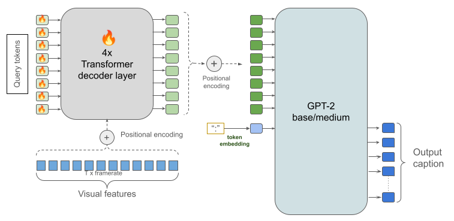

Hey everyone! Our team just won the [dense video captioning task at the SoccerNet Challenge](https://www.soccer-net.org/tasks/dense-video-captioning), part of **CVPR 2024**! 🎉⚽️🏆 For those of you who might not know, CVPR is one of the most prestigious conferences in computer vision, so this is a big deal for us. I thought I'd break down our approach and share some insights into how we tackled this challenge.

## The Challenge: [Soccernet Dense Video Captioning](https://www.soccer-net.org/tasks/dense-video-captioning)

The SoccerNet Challenge focused on Dense Video Captioning for soccer games. The task was to generate coherent captions describing soccer actions and localize each caption with a timestamp. This technology aims to highlight exciting moments and add captivating commentaries to soccer broadcasts.

The challenge provided 471 soccer broadcast videos with captions, including extracted features at 2 frames per second. We had to generate captions for various events like corners, substitutions, whistles, goals, and more. The evaluation metric was based on METEOR scores, comparing our generated captions with ground truth captions within a 30-second time window.

## Our Approach: Adapting BLIP-2 like architecture

We based our approach on a framework similar to BLIP-2, which is a powerful model for connecting vision and language tasks. Here's a simplified breakdown of our system:

1. **Video Feature Extraction**: We used pre-extracted visual features from the Baidu team, with a window size of 30 frames.

2. **Transformer Decoder**: We created a 4-layer transformer decoder that takes in 8 trainable query tokens and the visual features. This decoder acts as the backbone for all our tasks.

3. **Language Model Integration**: We fed the output from our decoder into a pre-trained language model (we used GPT-2) to generate the actual captions.

## Key improvements That Made the Difference

Now, here's where it gets interesting. We made several tweaks and improvements that really boosted our performance:

1. **End-to-End Training**: Instead of using a frozen pre-trained language model, we fine-tuned the entire system end-to-end. This was crucial for getting the model to generate relevant, soccer-specific captions.

2. **Multi-Class Classification for Action Spotting**: We initially tried binary classification (action vs. no action), but switching to multi-class classification for spotting actions in the video gave us a nice boost in performance.

3. **Confidence Thresholds**: We experimented with different confidence thresholds for including spotted actions in our captions. This helped filter out less reliable predictions and improve overall accuracy.

## Challenges and Lessons Learned

It wasn't all smooth sailing! We hit some problems along the way:

- Our initial attempts with frozen pre-trained language models produced gibberish captions. The models were hallucinating content that wasn't in the videos.
- Finding the right balance of parameters was crucial. We had to experiment with different window sizes, thresholds, and model configurations to get the best results.

And here's a funny story – our last submission was made just 30 seconds before the deadline! It didn't trigger an update on the leaderboard right away. We were on pins and needles wondering if it had gone through. Luckily, this last-minute submission actually performed worse on our validation set, so even if it had been counted, it wouldn't have changed our winning outcome.

## The Results

After all our hard work and experimentation, we achieved a METEOR score of 27.42 and a BLEU-1 score of 44.08 on the test set.

I want to give a huge shoutout to my teammate Liam. This truly was a team effort!

If you're interested in the nitty-gritty technical details, check out the upcoming paper or hit me up with questions. We also open sourced [our solution on Github](https://github.com/gladuz/soccernet-caption-deltalab)
 And if you're working on similar problems in AI and computer vision, I'd love to chat!
Stay tuned for more updates, and thanks for reading! 🚀📹🧠